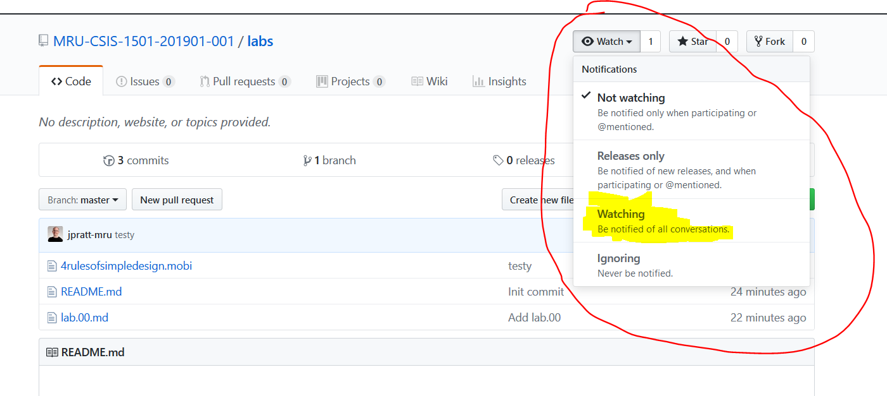

# Lab-00

## Goal for this lab

The goal of this lab is to become familiar with the 3 systems that will be used consistently throughout our course: **GitHub**, **REPL.IT**, and **INS**.

### GITHUB

All labs and assignment instructions will be available on [GitHub](https://github.com). It is in your best interest to be automatically notified of any changes/corrections to them; fortunately, GitHub allows us to do this through its **watch** feature.

In addition, having at least a working knowledge of GitHub is very beneficial if you want to pursue a career involving software development. Also, a growing number of our courses at MRU make use of GitHub as well.

Please do the following:

- [ ] sign up for a GitHub account here: https://github.com/
  - when you choose a username, choose something that wouldn't raise eyebrows in a job interview
- [ ] go to our [lab repository](https://github.com/MRU-CSIS-1501-201901-001/labs) and click the **Watch** dropdown and change the selection from **Not watching** to **Watching**: 
- [ ] repeat the process for our [assignment repository](https://github.com/MRU-CSIS-1501-201901-001/assignments)
- [ ] [optional] pick up a [GitHub Student Developer Pack](https://help.github.com/articles/applying-for-a-student-developer-pack/); it's not at all required for this course, but it's got some nice benefits if you're interested in software development

**Note:** sometimes notification emails from GitHub will get marked as spam; to avoid this, add **notifications@github.com** to your accepted emails.

### REPL.IT

REPL.IT is the site where you will be doing your skill drills, so you'll need to have an account and access to the course where those drills are located.

Let's get started:

- [ ] create a REPL.IT account
  - create an account by signing up at REPL.IT ... make sure you verify your email and update your profile (just add your first and last name to make my marking life easier and please also add the school).
  - If you want, here's a [quick video overview](https://drive.google.com/a/mtroyal.ca/file/d/1K-dHMREkC4_z_U5b7k4HUBLe0q8m3p5z/view?usp=sharing).
- [ ] enroll in our classroom
  - log in (if you're not in already) to your REPL.IT account
  - paste this enrollment link into the browser: https://repl.it/classroom/invite/4Ii47lS - you should now be able to see `2019 1501 Skill Drills` under your classrooms.
    - If you want, here's a [quick video overview](https://drive.google.com/a/mtroyal.ca/file/d/1PqeRqn1-mPn2MYpNsPgWWP-SP_vnRxqf/view?usp=sharing). The link and classroom name shown in the video is a bit different than our current one, but the steps are the same!
- [ ] take a look at the `practice lab quiz drill 00` drill
  - double-click on our classroom to open it
  - select the `practice lab quiz drill 00` drill
  - you don't have to do anything here at this point (though feel free to play around if you're so inclined) - I just wanted you to see what things look like

### INS

All assignments, lab quizzes, and the live coding portion of the final exam will be done on INS - so you need to get comfortable working there as quickly as possible.

Typically, working on INS involves logging in, editing some file(s) - which you might have to copy over from another directory on the system - and then logging off.

To give you a taste of this, do the following:

- [ ] log in to INS
- [ ] use the `cp -r` command to copy a directory to another directory
- [ ] use the `ls` command to "see" what files and directories are visible in your current directory
- [ ] use the `tree` command to "see" what files and folders are inside other directories
- [ ] use the `cd` command to "move" between directories
- [ ] use the `emacs` command to open a file for editing
- [ ] use the `emacs` command to create and edit a new file
- [ ] use the `ctrl + z` command to suspend emacs / `fg` command to resume it
- [ ] use the `ctrl + x, ctrl + s` command to exit emacs
- [ ] use the `ctrl + x, ctrl + c` command to exit emacs
- [ ] use the `rm` command to delete a file
- [ ] use the `rm -r` command to delete a directory
- [ ] use the `exit` or `ctrl + d` command to exit INS

#### RESOURCES

- a reference of Linux commands commonly used in this course is available here: https://bit.ly/mru-1501-linux-ref
- a reference for basic Emacs commands is available here: https://bit.ly/mru-1501-emacs-ref
- if you want to connect to INS from home or a laptop:
  - Windows how-to here: https://github.com/MRU-CSIS-1501/putty.setup.guide
  - Mac how-to here: https://github.com/MRU-CSIS-1501/mac.terminal.setup.guide
